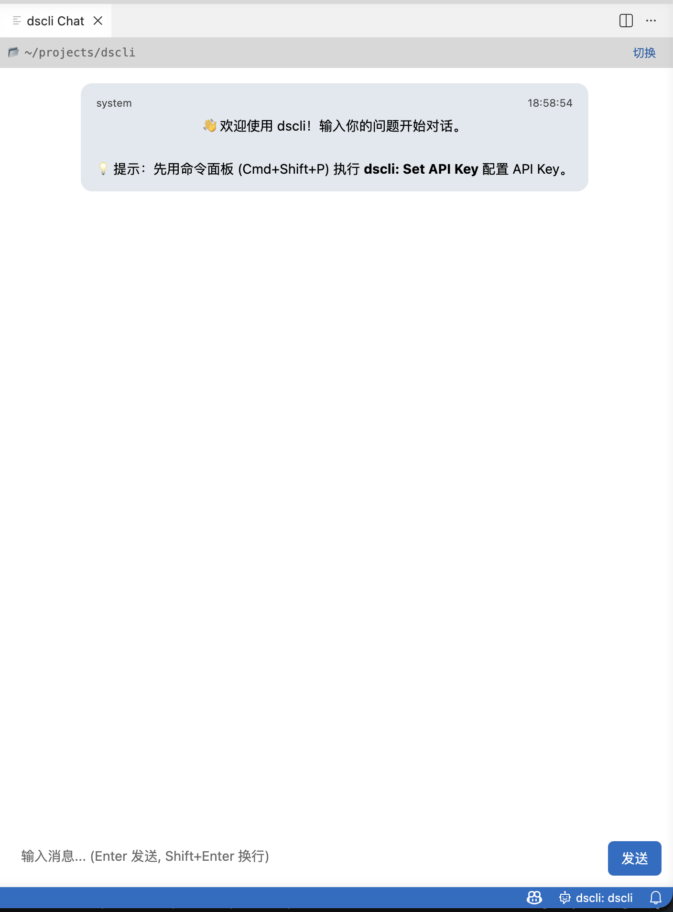

# dscli VSCode Extension

[](https://code.visualstudio.com/)
[](https://opensource.org/licenses/Apache-2.0)

将 [dscli](https://gitcode.com/dscli/dscli) 的 AI 编程能力集成到 VSCode，提供对话式代码助手体验。

扩展本身是一个轻量 UI 层，所有智能能力（对话、工具调用、项目上下文、技能系统）由 dscli CLI 后端提供。

## 界面预览



<!-- markdownlint-disable-next-line MD036 -->
*在 VSCode 面板中与 DeepSeek 大模型对话 — 支持 Markdown 渲染、代码高亮和流式实时输出*

---

## 功能

- **对话式 AI 聊天** — 在编辑器面板中直接与 DeepSeek 大模型对话
- **流式实时输出** — 响应逐字显示，可随时中断
- **Markdown 渲染** — 代码块、粗体、斜体、行内代码
- **文件分析** — 一键将当前文件或选中代码发送给 AI 分析
- **安全凭证管理** — API Key 通过 VSCode SecretStorage 存储，不写磁盘

---

## 前置要求

| 依赖 | 用途 | 安装方式 |
| ---- | ---- | ---- |
| **dscli CLI** | AI 对话后端 | `go install gitcode.com/dscli/dscli@latest` |
| **DeepSeek API Key** | 大模型认证 | [platform.deepseek.com](https://platform.deepseek.com/) |

验证 dscli 安装：

```bash
dscli version
```

---

## 安装

### 方法一：从 VSIX 安装

1. 从 [Releases](https://gitcode.com/dscli/dscli.vscode/releases) 下载最新 `.vsix` 文件
2. 安装：

   ```bash
   code --install-extension dscli-vscode-x.y.z.vsix
   ```

3. 重启 VSCode（`Cmd+Q` 后重新打开）

### 方法二：从源码构建

```bash
git clone https://gitcode.com/dscli/dscli.vscode.git
cd dscli.vscode
npm install
npm run build
code --install-extension dscli-vscode-*.vsix
```

---

## 配置

### 1. 设置 API Key（必须）

```text
Cmd+Shift+P → dscli: Set API Key
```

粘贴 DeepSeek API Key（`sk-...`）。密钥通过 VSCode SecretStorage 安全存储。

### 2. 自定义 dscli 路径（可选）

如果 `dscli` 不在系统 PATH 中：

1. `Cmd+,` 打开设置
2. 搜索 `dscli.executablePath`
3. 设置为完整路径，例如 `/Users/username/go/bin/dscli`

### 3. 选择模型（可选）

| 配置项                 | 默认值          | 可选值                                  |
| ---------------------- | --------------- | --------------------------------------- |
| `dscli.executablePath` | `dscli`         | dscli CLI 路径                          |
| `dscli.model`          | `deepseek-chat` | `deepseek-chat`, `deepseek-reasoner`    |

---

## 使用

| 操作 | 方式 |
| ---- | ---- |
| 打开聊天面板 | `Cmd+Shift+P` → `dscli: 打开 dscli 问答面板` |
| 分析当前文件 | `Cmd+Shift+P` → `dscli: 分析当前文件` |
| 设置 API Key | `Cmd+Shift+P` → `dscli: Set API Key` |
| 检查系统状态 | `Cmd+Shift+P` → `dscli: 检查系统状态` |
| 清空对话 | `Cmd+Shift+P` → `dscli: 清空对话历史` |
| 中断 AI 响应 | `Cmd+Shift+P` → `dscli: 中断当前操作`，或点击面板中的"停止"按钮 |

状态栏会显示 `$(hubot) dscli: 项目名`，点击可快速打开聊天面板。

---

## 故障排除

### 扩展一直显示 "activating"

1. 确认 `package.json` 中没有 `"type": "module"` 字段
2. `Cmd+Shift+P` → `Developer: Toggle Developer Tools` → 查看 Console 错误
3. 重新编译安装：`npm run build`

### "dscli: command not found"

```bash
# 确认安装
which dscli

# 如果找不到，确保 GOPATH/bin 在 PATH 中
export PATH=$PATH:$(go env GOPATH)/bin

# 或在 VSCode 设置中指定完整路径
```

### "API Key 未配置"

执行 `Cmd+Shift+P` → `dscli: Set API Key` 设置密钥。

### 无响应 / 响应不显示

1. 确认网络可访问 DeepSeek API
2. 确认 API Key 有效且有余额
3. 在终端测试：`echo "hello" | dscli chat`

---

## 卸载

```bash
code --uninstall-extension dscli.dscli-vscode
```

---

## 许可证

Apache License 2.0 — Copyright © 2025-2026 [dscli](https://gitcode.com/dscli)

## 链接

- [dscli 命令行工具](https://gitcode.com/dscli/dscli)
- [DeepSeek 开放平台](https://platform.deepseek.com/)
- [问题反馈](https://gitcode.com/dscli/dscli.vscode/issues)
